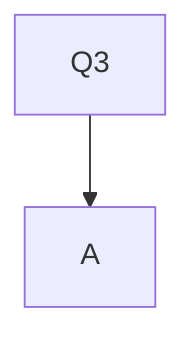
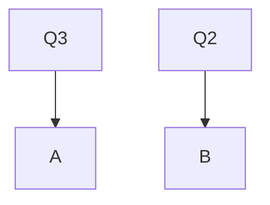

# Lecture for today: Wrap-up scheduling and begin discussion of IPC

[Part1](/CS6013/Operating%20Systems%20&%20Computer%20Architecture%20(Scheduling%20Part%20I)/README.md)

## MLFQ (Multi-Level Feedback Queue)

Goal: General-purpose scheduling
**Must** support two job types with distinct goals

* `interactive` programs care about response time
* `batch` programs care about turnaround time

Approach: **multiple** queues, each for a different **priority level**.
Pick a higher queue to run.
If more than one job in one queue, use **Round Robin(RR)** on that queue.

### Priorities

Rule 1: If Priority(A) > Priority(B), A runs

Rule 2: If Priority(A) == Priority(B), A & B run in RR
`Shared time in CPU`

> How do we set priorities?

Rule 3: Processes start at top prioty (highest queue)
Rule 4: If job uses whole slice, demote process, else leave at same level.
Rule 5: After some time period, move all jobs to the topmost queue and repeat.

/Images/Problem-MLFQ.png)
Problems with MLFQ

* Long running jobs will never received CPU time (**starvation**).
* Smart users could **game** the scheduler.

/Images/Prevent-Starvation.png)
Prevent Starvation - Boosting / Aging

* Time slice 10 unit
* Problem with low priority job may never get scheduled
* Periodically boost priority of all jobs (or all jobs that haven't been scheduled; aging).

> How to prevent gaming?

## Lottery Scheduling

*<ins>Really Simple to implement</ins>*

Goal: proportional(fair) share, but allow for weights.
Approach:

* Give processes lottery tickets.
* Whoever wins runs
* More tickets -> higher priority / share.

## Scheduling Summary

1. Understand goals (metrics) and workload, then design scheduler around that.
2. General purpose schedulers need to support processes with different goals.
3. Past behaviour is good predictor of future behavior.
4. Random algorithms (lottery scheduling) can be simple to implement, and avoid corner cases.
